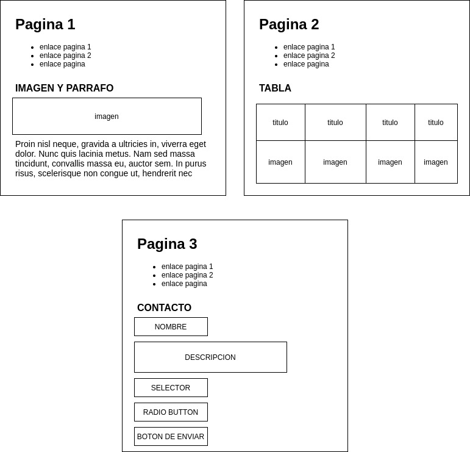
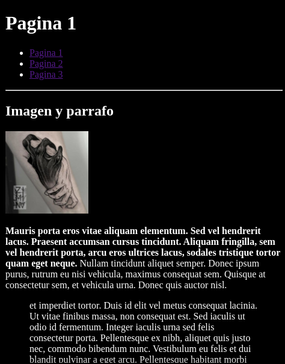
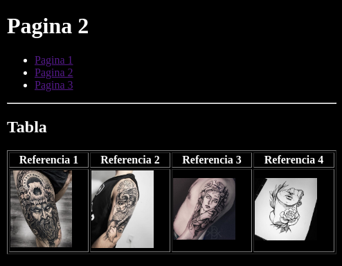
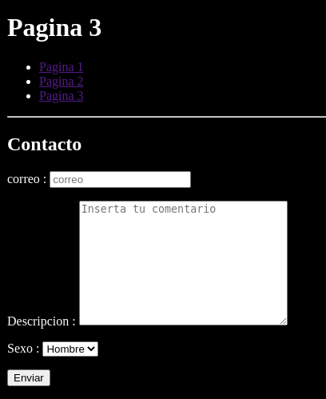

[VOLVER AL INDICE](../../README.md)

# Que se aprendera Javascript 

- Programacion desde 0
- Javascript moderno
- Jquery
- Maquetacion web
- TypeScript y JS POO
- Angular
- Node.JS
- Express/REST
- MEAN Stack
- Desarrollo web full-stack


# HTML repaso

- Que es html y una etiqueta
- Estructura HTML
- Etiquetas para textos 
- Listas
- Imagenes
- Tablas
- Formularios
- Ejercicio
- Multiples paginas
- Enlaces


## Que es html y etiqueta

- Base de cualquier pagina web -> HTML.
- No es un lenguaje de Programacion.
- Lenguaje de etiquetado o marcado que permite crear la estructura basica de una pagina web.
- Para darle estilo CSS, lenguaje de maquetacion, hojas de estilo en cascada.

Herramientas:
- Navegador web (Firefox, Google Chrome)
- Editor de codigo (Sublime, Vscode)

Cada etiqueta en html en html representa un elemento especifico en html y tiene una funcion especifica


```html
    <etiqueta atributo="valor de atrinuto"> 
        Texto o datos 
    </etiqueta>

    <strong>Hola mundo desde html</strong>
```

## Estructura HTML

```html
    <!DOCTYPE HTML>
    <html lang="es">
        <head>
            <title>Mi primera web</title>
        </head>

        <body>
            <h1>Titulo de mi web</h1>
            <h2>Bienvenidos a mi web</h2>
        </body>
    </html>
```

## Etiquetas para textos

```html
    <!DOCTYPE HTML>
    <html lang="es">
        <head>
            <title>Mi primera web</title>
        </head>

        <body>
            <h1>Titulo de mi web</h1>
            <h2>Bienvenidos a mi web</h2>

            <h3>Primer encabezado de la pantalla</h3>
            <p>
                Lorem ipsum dolor sit amet, consectetur adipiscing elit. Donec ullamcorper turpis ac velit interdum, sit amet feugiat odio aliquam. Fusce vel diam ornare, fermentum nunc eu, dictum tellus. Praesent iaculis fringilla mi id euismod.
                <blockquote>
                    Proin a velit quis neque sagittis euismod. Nunc consectetur euismod augue, eget rutrum dui luctus vel. Duis turpis metus, ultrices in lacus et, dapibus vulputate lectus. Curabitur sed condimentum nisi, vel efficitur diam.
                </blockquote> 
                
            </p>

            </hr>
            <h3>Primer encabezado de la pantalla</h3>
            <p>
                <strong>Proin nisl neque, gravida a ultricies in, viverra eget dolor. Nunc quis lacinia metus. Nam sed massa tincidunt, convallis massa eu, auctor sem.</strong> <em>In purus risus, scelerisque non congue ut, hendrerit nec ante. Vivamus bibendum lorem sed leo fringilla, sed aliquet est porttitor.</em> Vivamus eleifend erat in nunc faucibus, eu pretium quam dictum. Phasellus nec dignissim metus. </br> Proin dui justo, pulvinar accumsan leo sed, consequat ullamcorper arcu. Sed aliquet imperdiet ligula, <i>interdum aliquet neque lacinia vitae. Nam viverra metus sit amet est porttitor, id gravida nisi tristique.</i> <span id="resaltado" class="rojo amarillo">Nulla facilisis libero diam, pharetra blandit arcu elementum vel</span>.
            </p>
        </body>
    </html>
```

## Listas

```html
    <!DOCTYPE HTML>
    <html lang="es">
        <head>
            <title>Mi primera web</title>
        </head>

        <body>
            <h1>Titulo de mi web</h1>
        </hr>
        <h3>Lista ordenada</h3>
        <ul>
            <li>Manzana
                <ul>
                    <li>Manzana roja</li>
                    <li>Manzana verde</li>
                </ul>
            </li>
            <li>Naranja</li>
            <li>Pera</li>
            <li>Sandia
            </li>
        </ul>
        </body>
    </html>
```

## Imagenes

```html
    <!DOCTYPE HTML>
    <html lang="es">
        <head>
            <title>Mi primera web</title>
        </head>

        <body>
            <h1>Titulo de mi web</h1>
            <h2>Bienvenidos a mi web</h2>
            </hr>
            <h3>Lista ordenada</h3>
            <ul>
                <li>Manzana
                    <ul>
                        <li>Manzana roja</li>
                        <li>Manzana verde</li>
                    </ul>
                </li>
                <li>Naranja</li>
                <li>Pera</li>
                <li>Sandia
                </li>
            </ul>

            </hr>
            <h2>Imagenes en html</h2>
             

        </body>
    </html>
```

## Tablas

```html
<!DOCTYPE HTML>
<html lang="es">
    <head>
        <title>Mi primera web</title>
    </head>

    <body>
        </hr>
        <h2>Tablas</h2>

        <table border="1">

            <tr>
                <th>Nombre</th>
                <th>Apellidos</th>
                <th>Pais</th>
            </tr>

            <tr>
                <td>Kevin</td>
                <td>Astroz</td>
                <td>Colombia</td>
            </tr>
            
            <tr>
                <td>Alejandra</td>
                <td colspan="2">Calderon</td>
            </tr>

        </table>
    </body>
</html>
```

## Formularios

Enviar informacion al servidor

```html
<!DOCTYPE HTML>
<html lang="es">
    <head>
        <title>Mi primera web</title>
    </head>

    <body>
        <h1>Titulo de mi web</h1>
        <h2>Bienvenidos a mi web</h2>

        </hr>
        <h2>Formulario</h2>

        <form action="" method="get">
            <p>
                <label for="nombre">Nombre : </label>
                <input type="text" name="nombre" placeholder="Aqui va el nombre del usuario">
            </p>
            
            <p>
                <label for="descripcion">Descripcion : </label>
                <textarea name="descripcion" id="" cols="30" rows="10"></textarea>
            </p>

            <p>
                <input type="radio" name="genero" value="hombre">hombre</br>
                <input type="radio" name="genero" value="mujer">mujer</br>
                <input type="radio" name="genero" value="nada">nada</br>
            </p>

            <p>
                <select name="generodos">
                    <option value="hombre">hombre</option>
                    <option value="mujer">mujer</option>
                    <option value="nada">nada</option>
                </select>
            </p>

            <p>
                <input type="submit" value="Enviar formulario" >
            </p>

        </form>

    </body>
</html>
```

## Ejercicio



## Multiples paginas





## Enlaces

```html
<!DOCTYPE html>
<html lang="en">
<head>
    <meta charset="UTF-8">
    <meta name="viewport" content="width=device-width, initial-scale=1.0">
    <title>Pagina 3</title>
</head>
<body style="background-color: black;color: white;">
    <h1>Pagina 3</h1>
    <ul>
        <!-- enlaces -->
        <li><a href="pagina1.html">Pagina 1</a></li>
        <li><a href="pagina2.html">Pagina 2</a></li>
        <li><a href="pagina3.html">Pagina 3</a></li>
        <li><a href="pagina3.html" target="_blank">Pagina 3</a></li>
    </ul>
</body>
</html>
```


