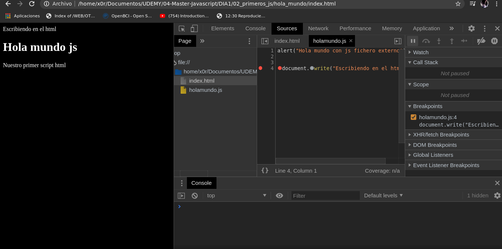

[VOLVER AL INDICE](../../README.md)

# Programacion desde 0 javascript

- primeros pasos
- Variables
- Tipo de datos
- Operadores
- Condicionales
- Bucles
- Alertar y ventanas
- Ejercicios
- Funciones
- Arrays
- Ejercicios

# Primeros pasos

## Herramientas de desarrollo

- navegador
- editor de codigo

## hola mundo javascript

crear dos ficheros:

- **index.html**

```html
    <!DOCTYPE html>
    <html lang="es">
        <head>
            <meta charset="utf-8">
            <title>Hola mundo js</title>

            <script type="text/javascript">
                alert("Hola mundo con js");
                alert("js mola");
            </script>

            <script type="text/javascript" src="holamundo.js"></script>

        </head>

        <body style="background-color: black;color: white;">
            <h1>Hola mundo js</h1>
            <p>Nuestro primer script html</p>
        </body>
    </html>
```

- **script.js**

```js
alert("Hola mundo con js fichero externo");
document.write("Escribiendo en el html");
```

## Consola (inspector de codigo)

permite interactuar directamente con la ejecucion de javascript y verficar valores para acceder desde el javascript y interacturar con mensajes de log se puede

```js
alert("Hola mundo con js fichero externo");
document.write("Escribiendo en el html");
var variable= "esto es un string";
console.log(variable);
```

En la pestaña de sources se pueden poner breakpoints.



# Variables

Espacio de memoria para almacenar informacion. Ejemplos basicos de variables

```js
//linea de comentario
/*
    Multilinea comentario
 */

 // declaracion de variables
var pais = "Colombia";
var continente = "Latino america";
var antiguedad = 2020;

// concatenacion
var pais_y_antiguedad = pais + antiguedad;

console.log(pais, continente, antiguedad);
console.log(pais_y_antiguedad);

// sobre escribiendo valores
pais = "Mexico";
console.log(pais);

// tener en cuenta que desde la 
// consola puedo cambiar valores
```

## modo estricto

Nos permite es nuestra programacion sea con mejores practicas y sea mucho mas restrictiva, activa las funcionabilidades nuevas de javascript, para activar esto se debe poner en el inicio. no permite crear variables sin definirlas. cosas del ecmascript 6 solo funciona con este modo estricto.

```js
'use strict'
```

## let y var

let : variables locales dentro de un scope usado.

var : variables globales.

```js
var variable1 = "variable";

if(true)
{
    let variable1 = "variable cambiada";
}

console.log(variable1);
```

## constantes

contenedor de datos este valor no sera modificable que nunca podra variar a lo largo del programa.

```js
const ip = "192.168.0.1";

const user = { name: 'Juan' };
user.name = 'Manolo';
console.log(user.name); // Manolo

const user = 'Juan';
user = 'Manolo'; // TypeError: Assignment to constant variable

const user = { name: 'Juan' };
user.surname = 'Padial';
console.log(user); // {name: 'Juan', surname: 'Padial'}
```


