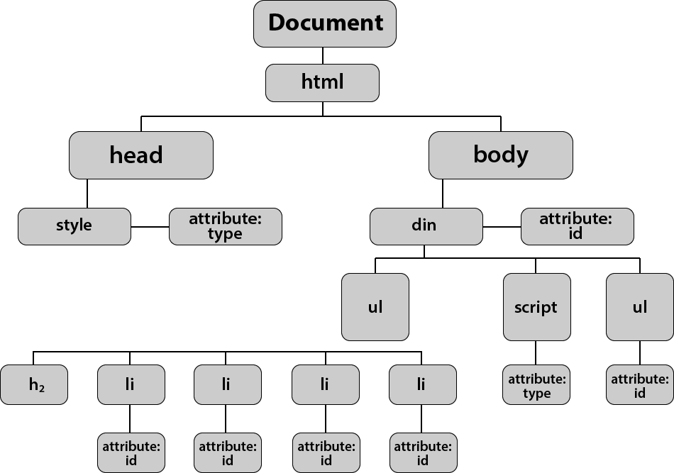

[VOLVER AL INDICE](../../README.md)



# DOM

Objeto abstracto que es la representacion del arbol de etiquetas dentro del documento html.

## Seleccion de un elemento

```javascript
// seleccionar elemento 
function cambiaColor(color){
    caja.style.color = color;
}

var caja = document.getElementById("caja");

caja.innerHTML = "Cambiado desde el js";
caja.style.background = "green";
caja.style.padding = "20px";
caja.style.color = "white";
caja.style.fontSize= "20px";


caja.className = "hola hola2";

console.log(caja);

console.log(caja.innerHTML);
```

## ejemplo del query selector 

recordar que el query selector solo toma un solo elemento

```javascript
var caja2 = document.querySelector("#caja"); // id
var caja3 = document.querySelector("div"); // etiqueta
var caja4 = document.querySelector(".caja"); // class

console.log(caja2);
console.log(caja3);
console.log(caja4);
```

## Seleccionar elementos y crear elementos

funciones usadas

- **document.getElementsByTagName() :** Trae todos los elementos por el nombre de la etiqueta
- **document.getElementById() :** Trae todos los elmentos que tenga asociada un id 
- **document.createElement() :** crea un nuevo elemento de tipo html apartir de su etiqueta
- **document.createTextNode() :** crea un nuevo elemento de tipo texto
- **elemento.appendChild() :** agregar un elemento creado a un elemento especifico
- **elemento.prepend() :** agrega un elemento creado antes de los elementos creados con anterioridad
- **section.append() :** parecido a appendChild

```javascript
var divs_all = document.getElementsByTagName('div');
console.log("todos los divs : ",divs_all);

var section =  document.getElementById("mi_seccion");
var hr = document.createElement("hr");
section.prepend(hr);

console.log("contenido texto del div 2:",divs_all[1].textContent); 
divs_all[2].innerHTML = "otro texto para el indice 1 !";
console.log("contenido texto del div 3:",divs_all[1].innerHTML); 

for(let i=0; i<divs_all.length ; i++){
    var parrafo = document.createElement("p");
    var texto = document.createTextNode(divs_all[i].innerHTML);
    parrafo.appendChild(texto);

    document.querySelector("#mi_seccion").appendChild(parrafo);
}
var hr2 = document.createElement("hr");
section.append(hr2);
```

## Seleccionar elementos por una clase

tener en cuenta que para traer varios elementos se debe usar la funcion querySelectorAll() por que si no solo traera el primer elemento encontrado.


```javascript
var rojo = document.getElementsByClassName("rojo");
var amarillo = document.getElementsByClassName("amarillo");

for(var div_rojo in rojo){
    if(rojo[div_rojo].className == "rojo"){
        rojo[div_rojo].style.background = "red";
    }
}

for(var div_amarillo in amarillo){
    if(amarillo[div_amarillo].className == "amarillo"){
        amarillo[div_amarillo].style.background = "yellow";
    }
}

// querySelector solo selecciona un elemento mas no todos

var id_encabezado = document.querySelector("#encabezado");
console.log(id_encabezado);

var q_class_rojo_one = document.querySelector(".rojo");
console.log("query selector rojo :", q_class_rojo_one);

var q_class_rojo_all = document.querySelectorAll(".rojo");
console.log("query selector all rojo :", q_class_rojo_all);
```


