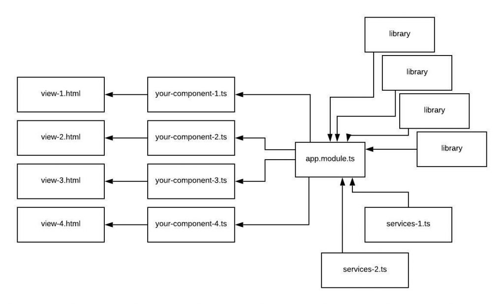
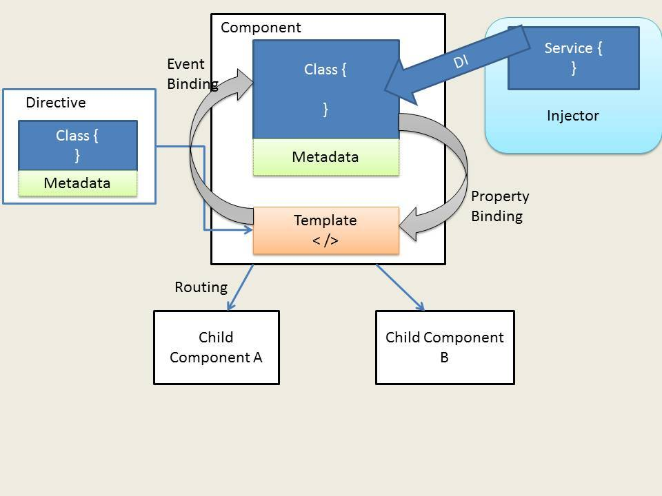
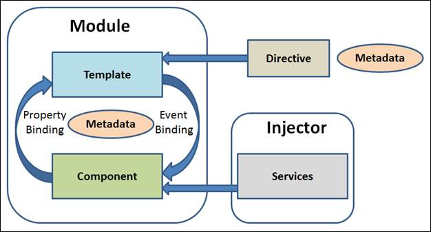

[VOLVER AL INDICE](../../README.md)

# Primeros pasos Angular

framework de javascript mas popular, es un framework desarrollado por google que permite realizar paginas web modernas, permite generar aplicaciones web de tipo spa (todo se hace en una misma pagina sin necesidad de recargarla), es de forma asincrona.

- Primeros pasos
- Componentes (trozo de una pantalla o una pagina de aplicacion)
- Modelos y clases
- Directivas estructurales
- enlaces de datos
- NgClass
- Routing
- NgTemplate
- Servicios y peticiones HTTP
- Filtro
- Formularios

# Instalar angular

- instalar node.js
- instalar angular

```
npm uninstall -g @angular/cli
npm cache verify
npm cache clear --force

npm install -g @angular/cli
```

https://cli.angular.io/

# Crear un nuevo proyecto y ejecutarlo

```
ng new PrimerProyecto
cd PrimerProyecto
ng serve --port 666
```

# estructura de un proyecto en angular

- archivo **tslint.json** : configuracion del linter del js
- archivo **tsconfig.json** : configuracion de typescript
- archivo **README.md** : documentacion del proyecto
- archivo **package.json** : configuracion principal del proyecto, comandos y dependencia del proyecto, se puede indicar nuevas dependencias
- archivo **angular.json** : archivos de configuracion del proyecto, definir assets del proyecto, configuraciond e testing y configuracion del proyecto de angular en general
- archivo **-gitignore** : para no commitear diferentes archivos del proyecto.
- directorio **e2e** : temas de pruebas y configuraciones internas
- directorio **node_modules** : librerias y dependencias de la aplicacion
- directorio **src** : todo el codigo fuente de la aplicacion
    - archivo **main.ts** : se carga la aplicacion de angular
    - archivo **polyfills.js** : configuraciones para los diferentes navegadores
    - archivo **index.html** : html principal donde se carga el div principal de aplicacion
    - directorio **app** : toda la aplicacion en angular en typescript
        - archivo **app.module.ts** : archivo modulo fichero que configura el componente principal de angular AppComponent y donde se puden invocar los otros modulos.
        - archivo **app.component.ts** : clase logica de ese componente
        - archivo **app.component.html** : la vista de ese componente
        - archivo **app.component.css** : estilos de la vista



# Conceptos teoricos de angular

- **COMPONENTES** : va a contrar un trozo de pantalla de la aplicacion o de la vista de la aplicacion, todo lo que esta en pantalla esta controlado y gestionado por los componentes.  la logica de un componente de angular es que da soporte a una vista interactuando y controlando las acciones de la vista por medio de metodos, propiedades dentro de del componente. Se encarga de ser mediador entre la vista (por medio de la plantilla) y la logica de la app. tambien puede ser una pagina en especifico.

```
Vista -> Componente(controlador) -> Modelo_de_datos
```

- **PLANTILLA** : son ficheros htmlDefinen las vistas de los componentes, son htmls y tienen una sintaxis especial de angular. como por ejemplo directivas y databinding.

- **DECORADORES Y METADATOS** : Los decoradores, es un patron de diseño, con el cual vamos a configurar dinamica mente atributos o metadatos de las clases y componentes. los metadatos van a describir a clases pero tambien describen relaciones, por ejemplo si un componente y una platilla se puede especificar con el decorador que esta plantilla y ese componente van unidos.

- **SERVICIOS** : Son clases que facilita la reutilizacion del codigo, son un tipo de elemento dentro de la arquitectura de angular, mediante la inyeccion de dependencias podemos usar los servicios en otros componentes principales.

- **PROVIDERS** : Son servicios que nos proveen de datos o funcionabilidades mediante sus metodos, existen providers/servicios propios de angular o creados por nosotros mismos.

- **PROVIDERS** : son funcionabilidades aplicables al DOM y a los elementos HTML en las plantillas de un componente. por ejemplo una directiva puede servir para controlar que un div se muestro o no, o recorrer un arrar en la vista ( HAY DIRECTIVAS ESTRUCTURALES, CONDICIONALES O DE CONTROL) o incluso tambien puede servir para darle un estilo a un elemento html. o tambien permite interatuar con el modelo de datos del componente.






- **MODULOS** : Normalmente una aplicacion tiene un solo modulo general que controla toda la aplicacion, ya que angular puede ser modular, se puede crear diferentes modulos de aplicacion, como la pagina web de la aplicacion, la pagina administrativa, la vista de clientes etc.
    

