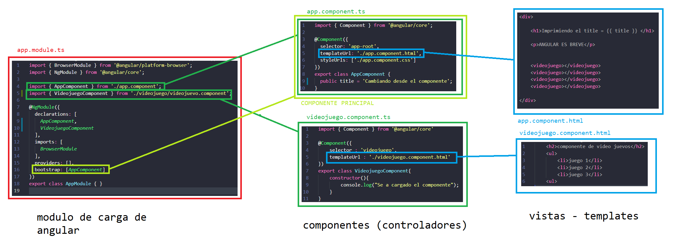

[VOLVER AL INDICE](../../README.md)

# Componetes

un componente puede ser, para el header, para el sidebar, para el calendario, para formulario o cualquier seccion de la web.

# Estructura de un componente

ARCHIVO : app.component.ts
```typescript

// librerias
// se carga el modulo o objetos componente de @angular/core
import { Component } from '@angular/core';

// decorador para configurar componete
// selector : se indica en que etiqueta o directiva de la pagina se cargara ese componente
// templateUrl : se define la vista en el template
// styleUrls : hoja de estilos para modificar el template
@Component({
  selector: 'app-root',
  templateUrl: './app.component.html',
  styleUrls: ['./app.component.css']
})

// se exporta a la clase de AppComponente y se definene la propiedaes y las funcionabilidades
// que va a tener el componente
export class AppComponent {
  title = 'PrimerProyecto';
}
```

ARCHIVO : app.component.html

```html
<div style="text-align: center;">

    <h1>Imprimiendo el title = {{ title }} </h1>

    <p>ANGULAR ES BREVE</p>

</div>
```

para que el componente funcione se debe configurar desde el app.module.ts

```typescript
// modulos necesarios para hacer funcionar el app.module.ts
import { BrowserModule } from '@angular/platform-browser';
import { NgModule } from '@angular/core';

// se importa la clase del componente
import { AppComponent } from './app.component';

// se usa el decorador que nos permite configurar el modulo
@NgModule({
    // declaracion de los componentes y directivas y pipes
    declarations: [
        AppComponent
    ],

    // modulos necesarios para los componentes externos o de nosotros
    imports: [
        BrowserModule
    ],

    // cargar servicios
    providers: [],

    // modulo principal que se va a cargar
    bootstrap: [AppComponent]
})

// se exporta el modulo
export class AppModule { }
```

# Crear un componente

1. crear una nueva carpeta dentro de app videojuego
2. crear un fichero videojuego.component.ts para el componente
3. crear una vista videojuego.component.hmtl




