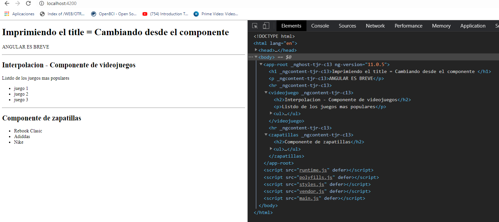

[VOLVER AL INDICE](../../README.md)

# Componetes

un componente puede ser, para el header, para el sidebar, para el calendario, para formulario o cualquier seccion de la web.

# Estructura de un componente

ARCHIVO : app.component.ts
```typescript

// librerias
// se carga el modulo o objetos componente de @angular/core
import { Component } from '@angular/core';

// decorador para configurar componete
// selector : se indica en que etiqueta o directiva de la pagina se cargara ese componente
// templateUrl : se define la vista en el template
// styleUrls : hoja de estilos para modificar el template
@Component({
  selector: 'app-root',
  templateUrl: './app.component.html',
  styleUrls: ['./app.component.css']
})

// se exporta a la clase de AppComponente y se definene la propiedaes y las funcionabilidades
// que va a tener el componente
export class AppComponent {
  title = 'PrimerProyecto';
}
```

ARCHIVO : app.component.html

```html
<div style="text-align: center;">

    <h1>Imprimiendo el title = {{ title }} </h1>

    <p>ANGULAR ES BREVE</p>

</div>
```

para que el componente funcione se debe configurar desde el app.module.ts

```typescript
// modulos necesarios para hacer funcionar el app.module.ts
import { BrowserModule } from '@angular/platform-browser';
import { NgModule } from '@angular/core';

// se importa la clase del componente
import { AppComponent } from './app.component';

// se usa el decorador que nos permite configurar el modulo
@NgModule({
    // declaracion de los componentes y directivas y pipes
    declarations: [
        AppComponent
    ],

    // modulos necesarios para los componentes externos o de nosotros
    imports: [
        BrowserModule
    ],

    // cargar servicios
    providers: [],

    // modulo principal que se va a cargar
    bootstrap: [AppComponent]
})

// se exporta el modulo
export class AppModule { }
```

# Crear un componente

1. crear una nueva carpeta dentro de app videojuego
2. crear un fichero videojuego.component.ts para el componente
3. crear una vista videojuego.component.hmtl


# Plantillas y propiedades

cuando se crea un nuevo componente normalmente se crea 2 ficheros un .component.ts (este es el controlador) y otro component.html (esta es la vista), como buena practica es usar un archivo separado para la vista por que si se usa en linea, sera complejo la lectura del codigo. para la parte de interpolacion de variables, dentro del componente puedo crear diferentes propiedades ya que el componente es un objeto, y darles un valor por medio de un metodo dado, ya sea el constructor o otro metodo. Cuando se quiere mostrar ese valor en la vista se realiza una interpolacion de varible o una invocacion con los operadores {{}}

**vista**
```html
    <h2>{{titulo}}</h2>
    <p>{{listado}}</p>
    <ul>
        <li>juego 1</li>
        <li>juego 2</li>
        <li>juego 3</li>
    <ul>
```

**controlador**
```typescript
import { Component } from '@angular/core'

@Component({
    selector : 'videojuego',
    templateUrl : './videojuego.component.html'
})
export class VideojuegoComponent{
    public titulo: string;
    public listado: string;

    constructor(){
        console.log("Se a cargado el componente");

        this.titulo = "Interpolacion - Componente de videojuegos"
        this.listado = "Listdo de los juegos mas populares"
    }
}
```

# Varios componentes

Varios componentes


Navegador



# Generar componentes por consola

```bash
ng generate component cursos
```

# Hooks y eventos de ciclo de vida

Los hooks son eventos que ocurren a lo largo de un ciclo de vida de un componente. son eventos que se van a lanzar dependiendo del estado que este el componente. iniciemos el componente, un cambio en el componente

## ngOnInit()

ngOnInit : metodo quer se ejecuta una vez cargado el componente

## ngDoCheck()

ngDoCheck : este metodo se ejecuta una vez que haya un cambio en el componente o en la apliacacion de angular

## ngDestroy()

ngOnDestroy : este metodo se ejecuta antes de eliminar la instancia de 

## ejemplo completo

```typescript
import { Component, OnInit, DoCheck, OnDestroy } from '@angular/core'

@Component({
    selector : 'videojuego',
    templateUrl : './videojuego.component.html'
})
export class VideojuegoComponent implements OnInit, DoCheck, OnDestroy{
    public titulo: string;
    public listado: string;

    constructor(){
        console.log("Se a cargado el componente");

        this.titulo = "Interpolacion - Componente de videojuegos"
        this.listado = "Listdo de los juegos mas populares"
    }

    // ngOnInit : metodo quer se ejecuta una vez cargado el componente
    ngOnInit(){
        console.log("OnInit ejecutado");
    }

    // ngDoCheck : este metodo se ejecuta una vez que haya un cambio 
    // en el componente o en la apliacacion de angular
    ngDoCheck(){
        console.log("DoCheck ejecutado");
    }

    cambiarTitulo(){
        this.titulo = "nuevo titulo del componente"
    }

    // ngOnDestroy : este metodo se ejecuta antes de eliminar la instancia de 
    // un componente
    ngOnDestroy(){
        console.log("OnDestroy ejecutado")
    }
}
```

## *ngIf="variable_booleana"

destruye un componente a partir de un estado booleana

```html
<videojuego *ngIf="mostrarVideoG"></videojuego>
```


