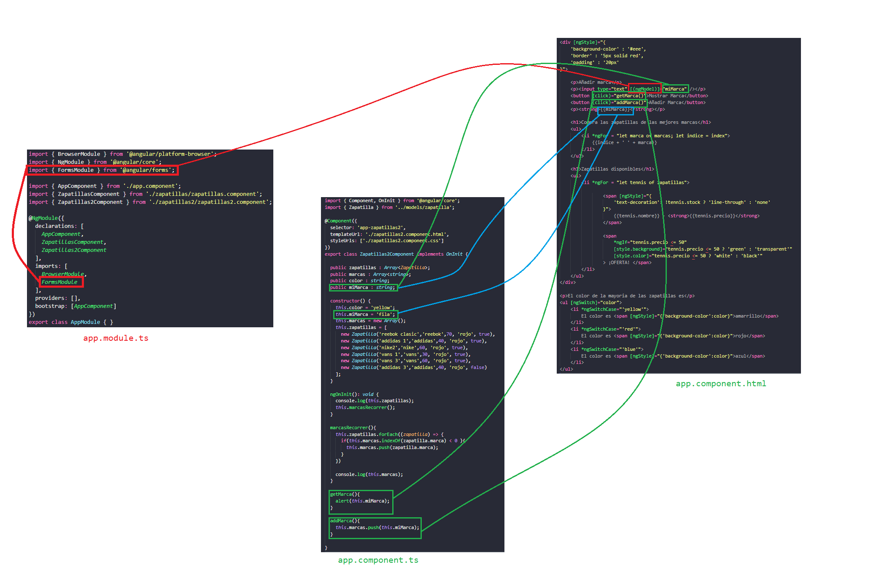

[VOLVER AL INDICE](../../README.md)

# Data binding y Eventos

Se usa NgModel para hacer una databinding bidireccional a una de las propiedades definidas en la clase del componente, los cambios realizados en este input con el operador NgModel se veran afectados en tiempo real, osea que los cambios que se realicen en la vista se vera reflejado automaticamente en el modelo de datos



# Evento click

vista
```html
    <h1>Compra las zapatillas de las mejores marcas</h1>
    <ul>
        <li *ngFor = "let marca of marcas; let indice = index">
            {{indice + ' ' + marca}} <button (click)="delMarca(indice)">borrar marca</button>
        </li>
    </ul>
```

componente
```typescript
delMarca(indice: number){
    this.marcas.splice(indice,1);
}
```

# Evento Blur y KeyUp

vista
```html
<p><input type="text" [(ngModel)]="miMarca" (keyup.enter)="onEnter()" /></p>
```

componente
```typescript
onEnter(){
    console.log('dio enter');
}
```

**TENER ENCUENTA EN EL ANGULAR.JSON SE AGREGAN LOS SCRIPTS Y LAS LIBERIAS EXTERNAS A USAR**

# ngClass

```html
<span [ngStyle]="{
    'text-decoration': !tennis.stock ? 'line-through' : 'none'
}">
    {{tennis.nombre}} - <strong [class.AltoPrecio]="tennis.precio >= 50">{{tennis.precio}}</strong>
</span>
```

```html
<span 
    [ngStyle]="{
        'text-decoration': !tennis.stock ? 'line-through' : 'none'
    }"
    [ngClass]="{'fondoRojo': tennis.precio > 50}">
    {{tennis.nombre}} - <strong 
    [class.AltoPrecio]="tennis.precio >= 50">{{tennis.precio}}</strong>
</span>
```
