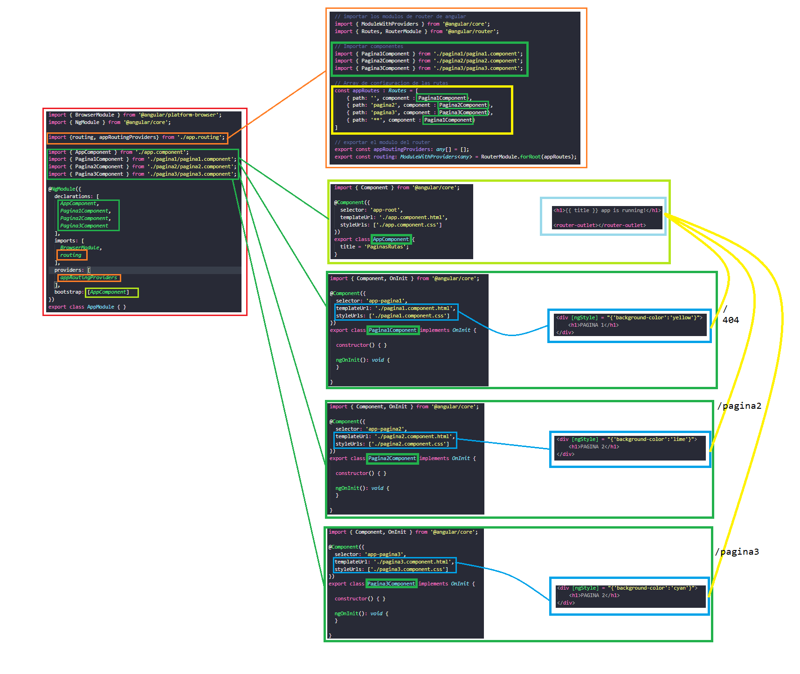

[VOLVER AL INDICE](../../README.md)

# Rutas y paginas

Se plantea crear que una pagina sea un componente especifico

1. Verificar en ``Proyecto\src\index.html` que contenga `<base href="/">`
2. Crear el fichero `Proyecto\src\app\app.routing.ts` en este archivo va ir toda la configuracion de las rutas o urls de la web

```typescript
// importar los modulos de router de angular
import { ModuleWithProviders } from '@angular/core';
import { Routes, RouterModule } from '@angular/router';

// Importar componentes
import { Pagina1Component } from './pagina1/pagina1.component';
import { Pagina2Component } from './pagina2/pagina2.component';
import { Pagina3Component } from './pagina3/pagina3.component';

// Array de configuracion de las rutas
const appRoutes : Routes = [
    { path: '', component : Pagina1Component},
    { path: 'pagina2', component : Pagina2Component},
    { path: 'pagina3', component : Pagina3Component},
    { path: '**', component : Pagina1Component}
]

// exportar el modulo del router
export const appRoutingProviders: any[] = [];
export const routing: ModuleWithProviders<any> = RouterModule.forRoot(appRoutes);
```

3. Agregar en el archivo app.module.ts importar el routing a su vez el appRoutingProviders, y agregar el routing al imports y el appRoutingProviders al providders

```typescript
import { BrowserModule } from '@angular/platform-browser';
import { NgModule } from '@angular/core';

import {routing, appRoutingProviders} from './app.routing';

import { AppComponent } from './app.component';
import { Pagina1Component } from './pagina1/pagina1.component';
import { Pagina2Component } from './pagina2/pagina2.component';
import { Pagina3Component } from './pagina3/pagina3.component';

@NgModule({
  declarations: [
    AppComponent,
    Pagina1Component,
    Pagina2Component,
    Pagina3Component
  ],
  imports: [
    BrowserModule,
    routing
  ],
  providers: [
    appRoutingProviders
  ],
  bootstrap: [AppComponent]
})
export class AppModule { }
```

4. Agregar en el componente principal la etiqueta <route-oulet> donde se vera redenrizado el componente por url

```html
<h1>{{ title }} app is running!</h1>

<router-outlet></router-outlet>
```

# Diagrama



# Creacion de menu instanteo

vista
```html
<nav>
    <a [routerLink] ="['/home']" [routerLinkActive]="['activado']">home</a>
    &nbsp;
    <a [routerLink] ="['/pagina2']" [routerLinkActive]="['activado']">pagina3</a>
    &nbsp;
    <a [routerLink] ="['/pagina3']" [routerLinkActive]="['activado']">pagina2</a>
</nav>
```

# Resaltar pagina actual en el menu

vista
```html
<nav>
    <a [routerLink] ="['/home']" [routerLinkActive]="['activado']">home</a>
    &nbsp;
    <a [routerLink] ="['/pagina2']" [routerLinkActive]="['activado']">pagina3</a>
    &nbsp;
    <a [routerLink] ="['/pagina3']" [routerLinkActive]="['activado']">pagina2</a>
</nav>
```

css
```css
.activado{
    background-color: cyan;
}
```

# Pasar parametros por url

pasar valores por la url y recogerlo en otro componente

app.routing.ts : se deben definir la cantidad de parametros a recibir por la url
```typescript
// Array de configuracion de las rutas
const appRoutes : Routes = [
    { path: '', component : Pagina1Component},
    { path: 'home', component : Pagina1Component},
    { path: 'pagina2/:nombre/:apellidos/:seguidores', component : Pagina2Component},
    { path: 'pagina2/:nombre/:apellidos', component : Pagina2Component},
    { path: 'pagina2/:nombre', component : Pagina2Component},
    { path: 'pagina2', component : Pagina2Component},
    { path: 'pagina3', component : Pagina3Component},
    { path: '**', component : Pagina1Component}
]
```

app.component.ts: se debe agragar Router, ActivatedRoute, Params del modulo router, tener en cuenta las variables privadas `private _route : ActivatedRoute` y `private _router : Router` que es donde se recibe la peticion y los valores de la peticion. y dentro de params vendra conetenido el objeto de los parametros dados por los nombres definidos en las rutas.

```typescript
import { Component, OnInit } from '@angular/core';
import { Router, ActivatedRoute, Params } from '@angular/router'

@Component({
  selector: 'app-pagina2',
  templateUrl: './pagina2.component.html',
  styleUrls: ['./pagina2.component.css']
})
export class Pagina2Component implements OnInit {

  public nombre : string;
  public apellidos : string;
  public seguidores : number;

  constructor(
    private _route : ActivatedRoute,
    private _router : Router 
  ) {  
    this.apellidos = "";
    this.nombre = "";
    this.seguidores = NaN;
  }

  ngOnInit(): void {

    this._route.params.subscribe(( params: Params ) => {
      console.log(params);
      this.nombre = params.nombre;
      this.apellidos = params.apellidos;
      this.seguidores = Number(params.seguidores) + 1000;

    } )
  }

}
```

vista: se muestra el valor asignado y recogido de los parametros
```html
<div [ngStyle] = "{'background-color':'lime'}">
    <h1>PAGINA 2</h1><br>
    <h2 *ngIf="nombre">Nombre : {{nombre}}</h2>
    <h2 *ngIf="apellidos">Apellido : {{apellidos}}</h2>
    <h2 *ngIf="seguidores">Seguidores : {{seguidores}}</h2>
</div>
```

# Redirecciones en el router navigate

component
```typescript
redireccion(){
  this._router.navigate(['/pagina3']);
}
```

vista
```html
<button (click)="redireccion()">Llevame a pagina 3</button>
```